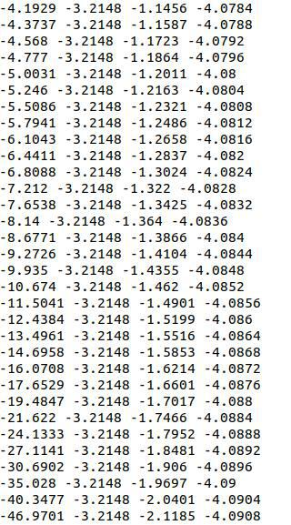
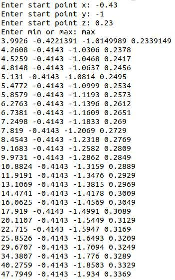

### Постановка задачи:  
Написать программу поиска максимума и минимума F(x, y, z) методом градиентного поиска(с постоянным шагом)  
  
### Вариант 16  
  
### Результаты поиска минимума:  
    
  
### Результаты поиска минимума:      
  