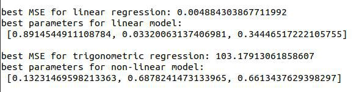

### Тема: Решение задачи аппроксимации методом случайного поиска.  
   
### Постановка задачи:    
- Данные записаны в файлы в csv-формате. Необходимо загрузить их в программу.  
- По этим данным предложить модель для аппроксимации. Для начала нужно реализовать линейную модель.  
- Настроить параметры модели методом случайного поиска (см. лекции). Для оценки качества модели можно использовать Среднюю квадратичную ошибку.    
- В процессе обучения выводить информацию об ошибке. И в результате вывести ответ: Как выглядит ваша модель со всем набором её параметров.  
- Предложить другую модель (использовать тригонометрические функции и пр.),выбрать параметры для нее. Сравнить ошибку с линейной моделью.   
### Вариант 16  
  
### Результат:  
  