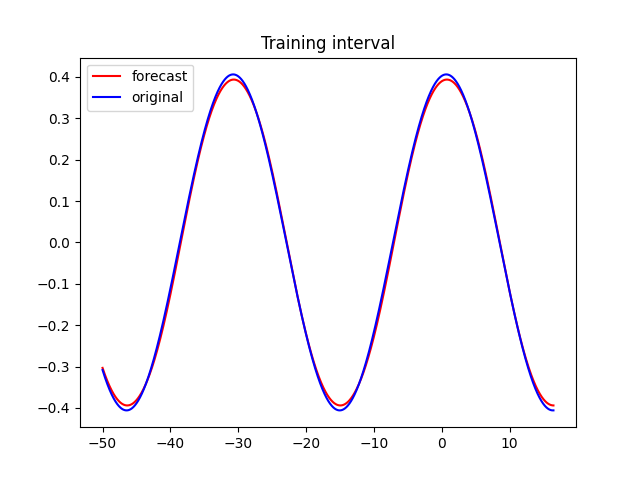
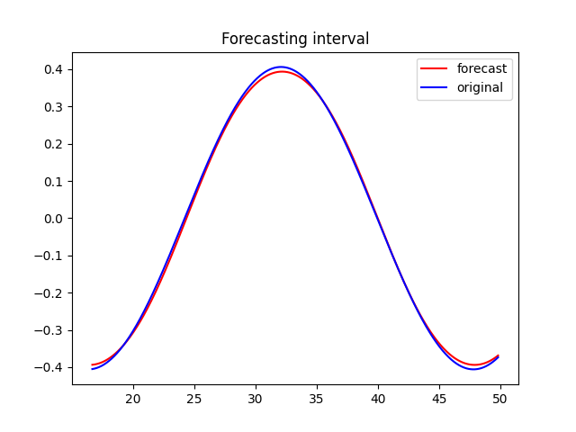

### Multilayer perceptron model with backpropagation learning rule  
  
### Test function for prediction:  
y = 0.4 * cos(0.2 * x) + 0.07 * sin(0.2 * x)  
  
### Forecast on training interval:   
  
  
### Forecast on testing interval: 
  
